# 🧁 Bakery Management System ("BAKE 'N TAKE")

An interactive, command-line interface (CLI) application built using **Python** and **MySQL** to streamline daily operations for small to medium-sized bakeries.

---
💡 Note on Authenticity: This project was designed, architected, and fully coded manually by me prior to the rise of AI coding assistants in 2022. Every SQL query, data structure, and logic flow was manually written to gain a solid, hands-on understanding of database connectivity and procedural Python programming. (Do appreciate that fact before we move on!)

## 📌 Features

* **🔐 Secure Authentication:** Protected access requiring an authorized username and password to log in.
* **📜 Interactive Menu Display:** Quick overview of all available bakery items with pricing.
* **➕ Add New Items:** Expand the menu by inserting new product details, initial stock, and pricing into the database.
* **🔍 Item Search:** Search for specific items using unique product IDs (`ItNo`).
* **🛒 Order Placement & Auto Billing:** Process multi-item customer orders, verify available stock, generate an itemized bill, and automatically update database stock.
* **✏️ Stock & Price Updation:** Easily adjust product inventory quantities or price tags.
* **📊 Full Inventory Tracking:** Display complete details of all items, stock levels, and categories stored in MySQL.

---

## 🖼️ Application Screenshots

### 1. Authentication & System Access
| Login Successful | Login Failed |
| :---: | :---: |
| 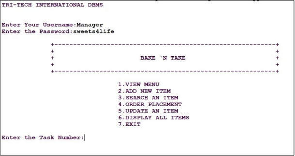 | 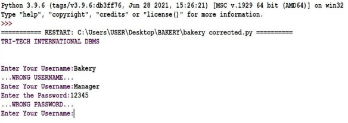 |

### 2. Adding Products & Inventory View
| Adding New Item | Added Item Displayed |
| :---: | :---: |
| 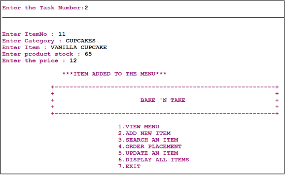 | 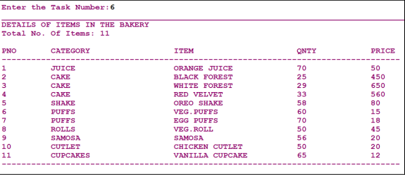 |

### 3. Product Search & Displaying Records
| Search for an Item | Displaying All Records |
| :---: | :---: |
| 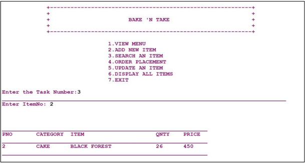 | 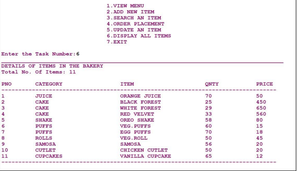 |

### 4. Order Placement & Automated Receipt
| Order Placement (Part 1) | Order Placement (Part 2) |
| :---: | :---: |
| 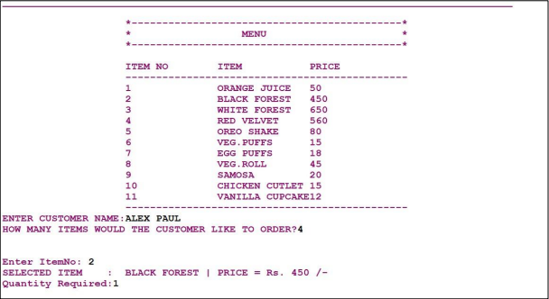 | 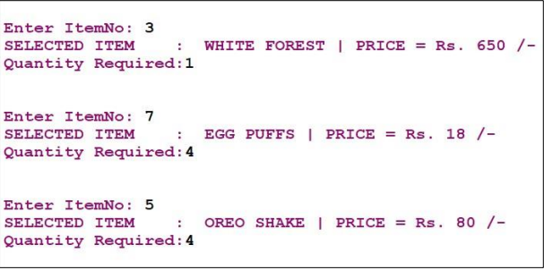 |

| Generated Invoice |
| :---: |
| 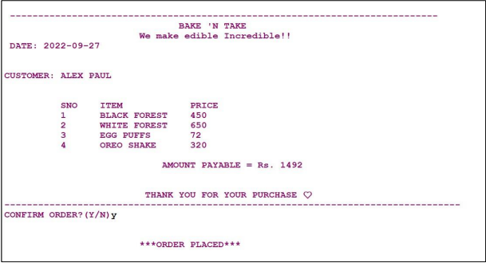 |

### 5. Inventory Updates & Exit
| Updating Quantity | Updated Quantity Displayed |
| :---: | :---: |
| 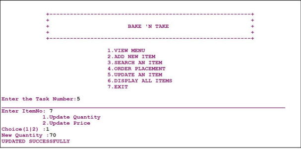 | 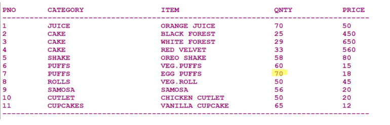 |

| Updating Price | Updated Price Displayed |
| :---: | :---: |
| 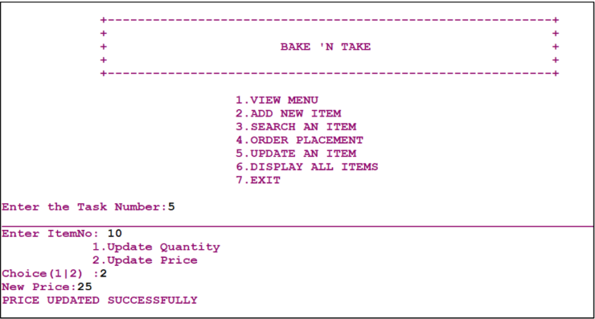 | 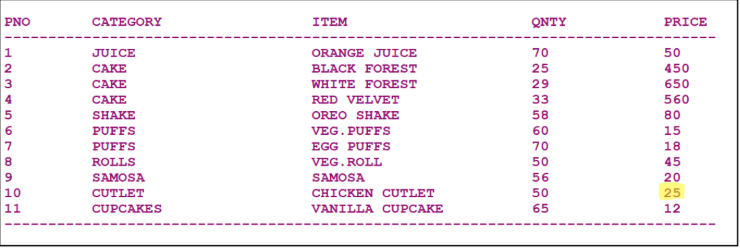 |

| System Exit |
| :---: |
| 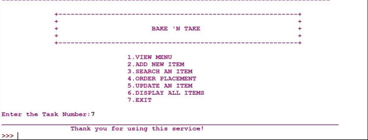 |

---

## 🛠️ System Requirements

### Hardware
* **Processor:** Intel Core i3 or equivalent
* **RAM:** 2 GB minimum

### Software
* **Operating System:** Windows 7 or higher / macOS / Linux.
* **Python:** 3.x installed
* **Database:** MySQL Server

---

## 🚀 Installation & Setup

### 1. Clone the Repository
```bash
git clone [https://github.com/your-username/bakery-management-system.git](https://github.com/your-username/bakery-management-system.git)
cd bakery-management-system
```

### 2. Install Required Python Packages
```bash
pip install mysql-connector-python
```

### 3. Database Setup
Ensure your MySQL server is running. Modify the database credentials in `src/main.py` if necessary:
```python
con = sql.connect(
    host="localhost",
    user="root",
    password="your_mysql_password"
)
```
*Note: The application automatically creates the database `BMS` and table `Products` upon the first run.*

### 4. Default Login Credentials
* **Username:** `Manager`
* **Password:** `sweets4life`

### 5. Run the Application
```bash
python src/main.py
```

---

## 🗄️ Database Schema

The system manages a table called `Products` within the `BMS` database:

| Field | Type | Constraint | Description |
| :--- | :--- | :--- | :--- |
| `ItNo` | `INT` | Unique Primary Key | Item Number |
| `Category` | `VARCHAR(25)` | - | Food Category (e.g., Cake, Puffs) |
| `Item` | `VARCHAR(25)` | - | Name of the Item |
| `Stock` | `INT` | - | Available Quantity|
| `Price` | `INT` | - | Unit Price in INR |

---
## 🗄️ Database Architecture

The application requires the `BMS` database and `Products` table. While the Python script automatically initializes this setup upon launch, you can also manually initialize the database schema using the provided SQL script:

* **SQL Script Location:** [`database/schema.sql`](database/schema.sql)

To import the schema directly into MySQL via command line:
```bash
mysql -u root -p < database/schema.sql

## 📜 License

This project is open-source and available under the [MIT License](LICENSE).
